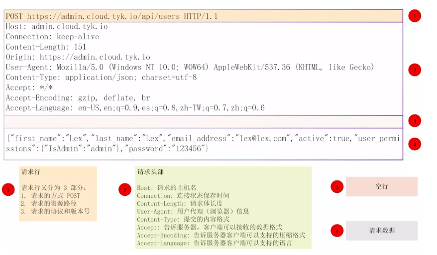

# go-restapp-demo

基本的restful服务分为以下几个步骤:

- 读取配置文件
- 初始化Logger
- 建立数据库连接
- 设置HTTP
- 启动服务
- 服务状态检查

#### 设置HTTP请求
**设置HTTP请求**又分为:

1. 设置Header
2. 注册路由
3. 注册中间件

#### 中间件

中间件实际上是对HTTP报文header部分的操作:

gin中使用use来注册中间件，详细代码参看 router/middleware

